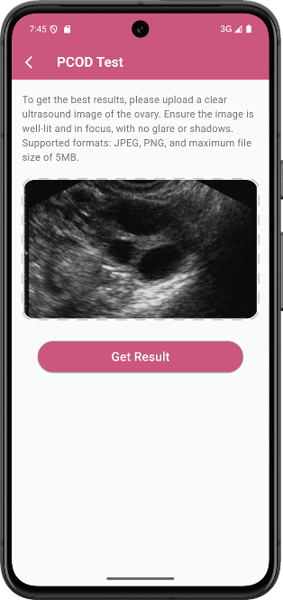
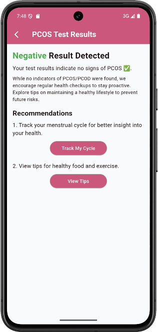

# Ultrasound-PCOS-Detection

This project applies **deep learning** and **transfer learning** techniques to detect **Polycystic Ovary Syndrome (PCOS)** using ultrasound images. By leveraging powerful pre-trained models like **MobileNetV2** and **EfficientNetV2B3**, the project aims to assist healthcare professionals in early and accurate diagnosis of PCOS.

<p align="center">
  
  
</p>


---

## Objective

Develop a high-accuracy image classification model to detect PCOS using pelvic ultrasound images, reducing the need for invasive procedures and enabling early intervention.

---

## Project Contents

- **Notebook**: `PCOS ultrasound detection.ipynb`
  - Data loading and augmentation
  - Transfer learning model setup
  - Model training and evaluation
  - Performance visualization and comparison

---

## Dataset

- **Input**: Ultrasound images labeled for PCOS presence.
- **Format**: Image files with binary classification (PCOS / Non-PCOS).
- **Structure**: Includes training, validation, and test splits.

---

## Approach

- Applied **Transfer Learning** using:
  - ✅ [MobileNetV2](https://arxiv.org/abs/1801.04381)
  - ✅ [EfficientNetV2B3](https://arxiv.org/abs/2104.00298)
- Fine-tuned the models on ultrasound image data.

---

## Model Performance

| Metric            | MobileNetV2 | EfficientNetV2B3 |
|-------------------|-------------|------------------|
| **Train Loss**     | 0.0343      | 0.0333           |
| **Train Accuracy** | 99.95%      | 99.65%           |
| **Val Loss**       | 0.0349      | 0.0355           |
| **Val Accuracy**   | 99.90%      | 99.57%           |
| **Test Loss**      | 0.0343      | 0.0338           |
| **Test Accuracy**  | 99.88%      | 99.65%           |

Both models performed exceptionally well, with **MobileNetV2 slightly outperforming** EfficientNetV2B3 in this task.

---

## Requirements

Install required Python libraries:

```bash
pip install tensorflow matplotlib seaborn numpy
```

## 👩‍🔬 Authors

This project was developed as part of a university graduation project focusing on AI-driven early PCOS detection using both clinical data and ultrasound images, delivering fast, accessible, and accurate health insights.
 Key AI Features:
• PCOD Detection from Ultrasound:
 Deep learning analyzes ovarian ultrasound images to identify cystic structures — offering high-accuracy, image-based diagnosis, even in subtle or asymptomatic cases.
• Symptom-Based Prediction
Machine learning models (best: Random Forest) predict PCOS from user-reported symptoms via an intelligent questionnaire.
• Voice Search for Doctors
 Speech recognition + NLP help users find doctors using simple voice commands.
• Symptom Tracking
AI learns from symptom patterns over time to deliver personalized health alerts and recommendations.

**University**: Faculty of Computer Science and Artificial Intelligence, Banha University


